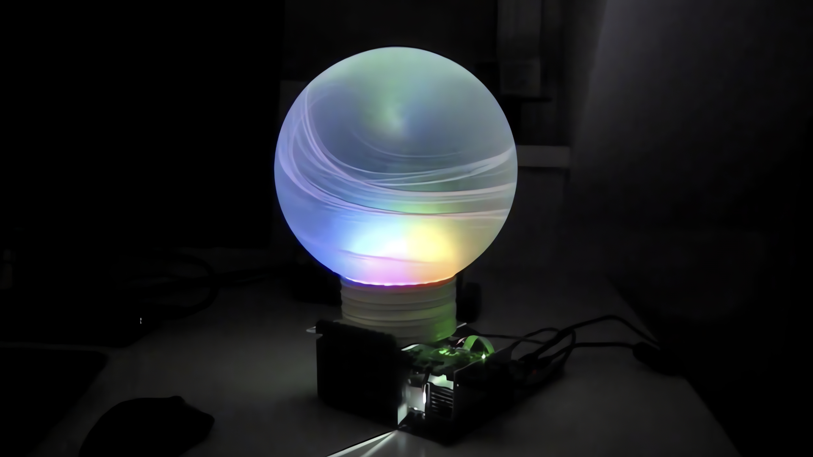

Maker Media GmbH

***

# Das KI-Orakel

### Analoges Kartenlegen war gestern. Heute sieht man digital in die Zukunft, mit Raspi, Beamer und ChatGPT. Für den stilechten Look sorgt eine Glaskugel, in der die Video-Vorhersagen wie durch Zauberhand erscheinen.

Ergänzend zum Artikel in der Make 4/24 findet ihr hier die Python-Programme für das KI-Orakel als Download.

Den vollständigen Artikel kann man in der **[Make-Ausgabe 4/24](https://www.heise.de/select/make)** lesen.
